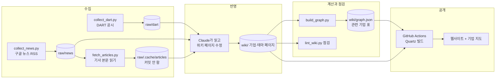

# 기업 관계 위키: 지금까지 개발한 내용 (2026-10-04 기준)

뉴스와 공시로 기업 사이의 관계를 정리하는 **GraphRAG 기반 LLM 위키**의 현재 상태, 구조, 설계 이유, 남은 문제, 논의 중인 다음 단계를 한 문서에 모았습니다. 자세한 규칙은 [`CLAUDE.md`](../CLAUDE.md), 진행 상황은 [`README.md`](../README.md)에 있습니다.

- 웹사이트: https://betago83.github.io/BetaGo83/
- 기업 지도: https://betago83.github.io/BetaGo83/static/map.html
- 저장소: https://github.com/BetaGo83/BetaGo83 (공개, GitHub 프로필 저장소 겸용)

---

## 1. 한눈에 보기

| 항목 | 지금 상태 |
|---|---|
| 테마 | 4개: HBM·반도체, 원전·SMR, 방산, 2차전지 |
| 기업 페이지 | 41개 (상장사, 해외 기업, 비상장사 포함) |
| 그래프 | 점 51개 (테마 4, 기업 41, 페이지 없는 상대 회사 6), 선 63개 (테마 41, 공급 11, 협력 7, 경쟁 3, 인수 1) |
| 모은 자료 | DART 공시 283건 (2026-09-27\~10-02), 뉴스 832건 (2026-09-30\~10-03, 제목·링크·날짜만) |
| 기사 본문 읽기 | 허용한 언론사 기사 399건 중 375건 읽음 (약 94%). 본문은 저장소에 올리지 않음 |
| 검증 | 위키 문장을 원자료와 두 번 대조 (294문장 중 84건, 301문장 중 24건 고침), 사이트·코드 점검 여러 차례 |
| 웹사이트 | Quartz로 만들어 GitHub Pages에 자동 배포. 검색, 그래프 보기, 기업 지도 |
| 자동 실행 | 아직 없음. 사용자가 "업데이트해 줘"라고 하면 Claude가 실행 |

일하는 방식은 간단합니다. 사람은 말로 시키고("업데이트해 줘", "점검해 줘", 질문), Claude가 자료를 모으고 읽어 위키를 고친 뒤 커밋하면 웹사이트가 저절로 다시 만들어집니다.

---

## 2. 전체 흐름



"업데이트해 줘"의 순서 (CLAUDE.md 반영 절차):

1. 공시와 뉴스를 모으고(URL과 공시 접수번호로 중복 제거), 새 기사 본문을 읽는다.
2. Claude가 테마와 관련된 사실만 골라 기업·테마 페이지를 고치거나 만든다. 관계는 양쪽 페이지에 짝을 맞춘다.
3. `build_graph.py`로 그래프와 관련 기업 표를 다시 만든다.
4. `lint_wiki.py`로 점검하고 문제를 고친다.
5. 변경 기록(`wiki/log.md`)을 남긴다.
6. 커밋하고 `main`에 올리면 웹사이트가 다시 배포된다.
7. 바뀐 내용을 사용자에게 몇 줄로 알린다.

---

## 3. 기본 원칙 (왜 이렇게 만들었나)

1. **출처 없는 사실은 쓰지 않는다.** 모든 관계와 이슈에 원문 링크(DART 공시 또는 기사)와 날짜를 붙인다.
2. **원자료에 적힌 것만 사실로 쓴다.** 추측, 전망, 매수·매도 의견, 목표가는 쓰지 않는다. 본문을 못 읽은 기사는 제목에 적힌 것만 쓴다.
3. **공개 저장소다.** 기사 본문이나 요약을 옮겨 적지 않는다. 커밋하는 원자료는 제목, 링크, 날짜, 출처 같은 메타데이터와 DART 공시 정보뿐이다.
4. **사람 메모는 건드리지 않는다.** 페이지마다 `## 사람 메모` 칸은 사람 몫이다.
5. **API 키는 GitHub에 두지 않는다.** 키는 Claude 클라우드 환경의 환경 변수에만 있다. 링크는 키가 없는 공시 뷰어 주소만 저장한다.
6. **위키가 원본이고 그래프는 계산 결과다.** 사람과 Claude는 마크다운만 고치고, 그래프 데이터는 스크립트가 다시 만든다. 그래프 DB나 벡터 DB를 따로 두지 않는다.

모든 페이지와 사이트 하단에 면책 문구를 넣는다: "AI가 뉴스와 공시를 바탕으로 정리한 참고 자료입니다. 틀린 내용이 있을 수 있으니 원문을 확인하세요. 투자 권유가 아닙니다."

---

## 4. 위키 설계

### 4.1 택소노미: 두 층만

- 깊은 산업 분류표를 만들지 않고 **테마 → 밸류체인 단계** 두 층으로만 나눈다.
- 기업 하나가 점 하나. 같은 회사인지는 DART 고유번호(`dart_corp_code`)로 판단한다.
- 테마마다 단계 목록을 정해 두고, 한 기업은 한 테마에서 한 단계에만 둔다.

| 테마 | 단계 (`stages`) | 관련 기업 |
|---|---|---|
| HBM·반도체 | 메모리 제조, 후공정 장비, 하이브리드 본딩, 검사 장비·부품, 공정 모니터링, 패키지기판, 전력반도체 후공정 | 13곳 |
| 2차전지 | 배터리, 양극재, 전고체 원료, 제조 장비, 소재 공장 설비 | 12곳 |
| 원전·SMR | 해외 원전사업, 설계, 원전·SMR 사업, 사업개발·투자, 사용후핵연료 처분, 해상 SMR(조선), 원전 설비·장비 | 9곳 |
| 방산 | 지상 무기체계, 추진기관, 유도무기, 함정, 센서·부품 | 7곳 |

### 4.2 페이지 종류

| 페이지 | 위치 | 내용 |
|---|---|---|
| 기업 | `wiki/companies/<DART 공식 회사명>.md` | 한 줄 요약, 사업 개요, 관계 표, 테마(단계와 역할), 최근 이슈, 사람 메모 |
| 테마 | `wiki/themes/<테마명>.md` | 테마 설명, 밸류체인(단계별 기업과 출처), 관련 기업 표(스크립트가 만듦), 최근 동향 |
| 첫 화면 | `wiki/index.md` | 소개, 테마 목록, 최근 업데이트 |
| 변경 기록 | `wiki/log.md` | 업데이트마다 읽은 자료 수, 만든·고친 페이지. 맨 아래에 추가만 한다 |
| 기업 지도 안내 | `wiki/기업 지도.md` | 지도(`static/map.html`)를 페이지 안에 보여 준다 |

기업 페이지 frontmatter: `type, name, ticker, market, dart_corp_code, aliases, themes, updated`. 별칭(`aliases`)은 사이트 검색과 지도 검색에 쓰이고, 페이지 이름이나 다른 별칭과 겹치면 안 된다(사이트 주소가 겹친다).

### 4.3 관계 종류 (양쪽 페이지에 짝으로 적는다)

| 관계 | 뜻 | 상대 페이지의 짝 |
|---|---|---|
| 공급사 / 고객사 | 납품 관계 | 고객사 / 공급사 |
| 출자 / 피출자 | 지분 보유 | 피출자 / 출자 |
| 인수 / 피인수 | 인수 | 피인수 / 인수 |
| 계열, 협력, 경쟁 | 같은 그룹, MOU·공동개발, 같은 시장 | 같은 이름 |

- 관계가 아직 없으면 빈 표 대신 `- 아직 확인된 관계가 없습니다.`라고 적는다.
- 상대가 위키에 없는 회사면 이름만 적고, 두 기업 이상의 관계 표에 나오면 그 회사 페이지를 만든다.

### 4.4 이슈 종류와 쓰는 법

`계약, 수주, 투자, 인수합병, 협력, 실적, 정책, 기타`

- 이슈 줄마다 `[[테마]]` 링크를 단다. 테마와 무관한 큰 사건은 사업 개요에만 적는다.
- 종류는 부풀리지 않는다. 계약서·공시 없는 '도입'·'공급 보도'는 협력·기타, 전환사채·생산 시작·선급금·기간만 바뀐 정정 공시는 기타.
- 같은 사건을 다룬 기사·공시가 여럿이면 한 줄에 모은다(점수가 두 번 들어가지 않게).
- 금액은 공시 숫자 그대로 또는 '약'을 붙인다.

---

## 5. 그래프 (GraphRAG) 설계

- **점**: `company`(기업 페이지), `theme`(테마 페이지), `external`(페이지가 아직 없는 상대 회사). 나중에 `institution`(기관), `product`(제품·기술)를 더할 수 있다.
- **선**: 공급(납품하는 쪽 → 받는 쪽), 출자·인수(하는 쪽 → 받는 쪽), 계열, 협력, 경쟁, 테마(기업 → 테마, 단계·1차/2차·점수 포함). 같은 관계를 양쪽에 적어도 선은 하나.
- **근거**: 선마다 날짜, 내용, 원문 링크 목록이 붙는다. 지도와 답변에서 그대로 보여 준다.
- **질문에 답하는 법**: 기업 질문은 `graph.json`에서 그 기업(별칭 포함)을 찾아 선을 두 단계까지 따라가 근거를 모으고 기업 페이지를 읽는다. 테마 질문은 테마 페이지를 요약본으로 쓴다.

### 관련 기업 점수 (초안)

기업 c, 테마 t에 대해 근거마다 `가중치 × 0.5^(경과일 / 90)`을 더한다(90일마다 절반).

- 가중치: 계약·수주·투자·인수합병 3, 협력 2, 실적·정책·기타 1. 출처 중 하나라도 DART 공시면 1.5배.
- **1차**: 테마 페이지 밸류체인에 있거나 `[[t]]`가 달린 근거가 있는 기업.
- **2차**: t의 근거는 없지만 1차 기업과 공급·출자 관계로 이어진 기업. 이어진 1차 기업 중 가장 높은 점수의 30%. (지금 데이터에는 2차 기업이 아직 없다.)

---

## 6. 저장소 구성

```text
raw/news/YYYY-MM-DD.jsonl   뉴스 메타데이터 (title, url, outlet, outlet_url, published_at, theme, query)
raw/dart/YYYY-MM-DD.jsonl   공시 (접수번호, 회사, 보고서명, 접수일, 뷰어 링크, 사건 공시는 핵심 항목)
raw/dart/covered.json       공시를 어디까지 빠짐없이 받았는지
raw/.cache/                 기사 본문 등 커밋하지 않는 임시 자료 (.gitignore)
wiki/                       위키 (옵시디언 볼트로도 열 수 있음)
scripts/                    수집·본문 읽기·그래프·점검 스크립트 (Python, 표준 라이브러리만 사용)
site/                       웹사이트 설정, 기업 지도, Quartz 손보기 스크립트
docs/                       허용 도메인 목록, 이 문서
.github/workflows/deploy.yml   웹사이트 빌드·배포
.githooks/pre-commit        커밋 전 키 검사
.claude/                    세션이 시작될 때 키 검사 훅을 켜는 설정
CLAUDE.md                   Claude가 위키를 관리하는 규칙
```

### 6.1 스크립트

| 스크립트 | 하는 일 |
|---|---|
| `collect_dart.py` | DART 오픈API에서 상장사 주요 사건 공시(공급계약, 출자, 시설투자, 합병 등)와 위키 기업의 공시를 모은다. 사건 공시는 원문에서 계약 상대·금액 같은 핵심 항목을 뽑는다. 지난번에 받은 날부터 이어서 받는다(90일 단위 조회). 저장·출력하는 링크는 키 없는 공시 뷰어 주소만 쓴다 |
| `collect_news.py` | 테마 페이지의 `keywords`로 구글 뉴스 RSS를 검색해 제목·링크·언론사·날짜만 저장한다(기본 최근 3일). 네이버 키가 있으면 네이버 뉴스도 쓴다(지금은 키 없음). URL·제목 중복과 도박·성인 스팸을 거른다 |
| `fetch_articles.py` | 기사 본문을 읽어 `raw/.cache/articles/`에 저장한다(커밋 안 함). 아래 6.2 참고 |
| `build_graph.py` | 위키 페이지를 읽어 `wiki/graph.json`과 테마 페이지의 관련 기업 표를 만든다. 점수 계산도 여기서 한다 |
| `lint_wiki.py` | 위키 점검. 아래 6.3 참고 |
| `find_corp.py` | 회사 이름으로 DART 고유번호를 찾는다 |
| `list_news_domains.py` | 클라우드 환경에 허용할 언론사 도메인 목록을 만든다(위키가 인용한 언론사 먼저, 언론사 60곳까지) |
| `check_secrets.py` | 커밋하려는 파일에 API 키가 섞였는지 검사한다(키 값은 출력하지 않음) |
| `wiki_common.py` | 공통 도구: 페이지 읽기, 원자료 읽고 쓰기, 키 가리기, 한국 시간, 도메인 정리 |

### 6.2 기사 본문 읽기 (`fetch_articles.py`)

1. 구글 뉴스 RSS 링크는 원래 기사 주소로 바꾼다(구글 뉴스 페이지가 쓰는 요청을 그대로 사용). 한 번 푼 주소는 저장해 두고 다시 쓴다.
2. 클라우드 환경은 암호화하지 않은 `http://` 접속을 막으므로 `https://`로 바꿔 연다.
3. 본문 찾기 순서:
   - 언론사 프로그램이 본문에 붙이는 이름(`articleBody` 등)이 있는 묶음을 먼저 본다.
   - 없으면 긴 글이 많이 모인 묶음을 점수로 고른다(readability 방식).
   - 고른 글에 기사 제목 낱말이 거의 없으면(유료 안내, 저작권 안내 같은 엉뚱한 곳) 다음 후보로 넘어간다. 낚시성 제목이면 기사 요약문(description)과도 비교한다.
   - 그래도 없으면 페이지 속 JSON(JSON-LD `articleBody`, 조선일보 같은 Arc XP 사이트)에서 본문을 찾는다.
4. 본문이 아닌 것 빼기: 댓글, 관련 기사, 공유 단추, 광고, AI 요약 상자, 숨긴 주식 시세 팝업, 링크만 있는 목록, '내 댓글 모음'·'이미지 확대' 같은 화면 단추 줄, 저작권 안내 줄.
5. 광고로 끊긴 본문(예: 재경일보 jkn.co.kr)은 이어 붙인다. 다른 기사 묶음은 붙이지 않는다.
6. 500자보다 짧은 본문은 '짧음'으로 표시한다(유료 기사 앞부분이나 사진 기사일 수 있어 제목 수준으로만 쓴다).
7. 끝에 '접속이 막힌 사이트' 목록을 알려 준다. 허용 목록에 더할 후보다(포털 전체·블로그 등은 제외).

옵션: `--date`, `--all`, `--cited`(위키가 인용한 기사), `--url`, `--theme`, `--limit`, `--retry`(실패·짧은 기사 다시), `--refresh`(전부 다시), `--show`(본문 보기), `--chars`, `--delay`.

시험 결과 (기사 832건):

| 결과 | 건수 | 설명 |
|---|---|---|
| 읽음 | 375 | 허용한 언론사 기사 399건 중 약 94% |
| 접속 허용 안 됨 | 433 | 허용 목록(언론사 60곳)에 없는 사이트. 구인 광고·해외 사이트도 많음 |
| 사이트가 막음 (HTTP 403) | 11 | 뉴스1, 쿠키뉴스 (자동 접속 차단) |
| 인증서 오류 | 3 | 해사신문, 증권일보 |
| 본문 없음 | 3 | 정책브리핑(문서 뷰어), 본문 없는 속보 등 |
| 일시적 접속 실패·없는 페이지 | 7 | 동아일보 시간 초과, 연결 끊김, 지워진 기사 등 |

### 6.3 점검 (`lint_wiki.py`)

- 깨진 링크, 출처 없는 줄, 면책 문구·사람 메모 칸·frontmatter 빠짐, 모든 페이지의 `updated`
- 이슈 형식과 종류, 이슈마다 테마 링크, 미래 날짜(계약 종료일을 날짜 칸에 넣은 경우)
- 짝이 맞지 않는 관계, 1년 넘은 관계, 페이지 없이 두 번 이상 나온 상대 회사, 빈 관계 표
- 밸류체인 단계가 테마·기업 페이지에서 서로 맞는지, 밸류체인 회사마다 출처
- 별칭·DART 고유번호·종목코드 중복, 고아 페이지
- 한 줄에 물결표(~)가 두 번 나와 사이트에서 취소선이 되는 줄
- `graph.json`과 관련 기업 표가 최신인지

---

## 7. 웹사이트

- **Quartz v4.5.2**(옵시디언 위키를 웹사이트로 만드는 도구)를 커밋으로 고정해 GitHub Actions에서 빌드하고 GitHub Pages로 배포한다. 저장소에는 Quartz 코드를 넣지 않는다.
- `main`에 `wiki/`, `site/`, 배포 설정이 바뀌어 올라가면 1분 안팎에 사이트가 다시 만들어진다.
- 빌드는 한국 시간(`TZ=Asia/Seoul`)으로 한다.
- `site/patch_quartz.py`가 빌드 전에 Quartz를 조금 고친다. 고칠 곳을 못 찾으면 빌드를 멈춰서, Quartz를 올렸을 때 조용히 빠지지 않게 했다.
  - 한국어 검색: 낱말 중간도 찾기('하이닉스' → SK하이닉스), 별칭 검색('한수원', 'KHNP'), 결과 미리보기에서 찾은 부분 보여 주기
  - 처음 연 페이지가 아래로 내려가 제목이 안 보이던 문제
  - 영어로 남은 문구 한국어로, 링크 미리보기 그림 형식 버그
- `site/quartz.layout.ts`: 모든 페이지 하단 면책 문구와 기업 지도 링크, 탐색기 폴더 이름 한국어, 한국어 줄바꿈(낱말 중간에서 끊지 않기), 표 칸 너비 조정, 읽는 시간 표시 끔.
- 사이트에는 옵시디언처럼 페이지끼리 이어진 그래프 보기, 검색, 역링크, 목차, 어두운 화면이 있다.

### 7.1 기업 지도 (`site/static/map.html`)

외부 라이브러리 없이 만든 한 장짜리 페이지로, `graph.json`을 읽어 그린다.

- 기업·테마가 점, 관계가 선. 선 색이 관계 종류, 화살표가 방향(공급: 납품하는 쪽 → 받는 쪽).
- 점이나 선을 누르면 관계, 테마 점수, 근거(날짜, 내용, 공시·기사 링크)가 설명 칸에 나온다.
- 테마 고르기, 관계 종류 켜고 끄기, 이름·별칭 검색, 끌어서 옮기기, 휠·두 손가락 확대, 키보드 조작, 위키의 밝은/어두운 화면 설정 따라가기.
- 휴대폰에서 많이 축소하면 읽을 수 없는 작은 기업 이름은 숨기고 "확대하면 기업 이름이 보입니다"를 띄운다. 고른 점 이름은 크게 보인다.
- 위키 페이지 안에 넣었을 때는 설명 칸을 지도 아래에 두어 지도를 넓게 쓰고, 점을 눌러도 바깥 페이지가 움직이지 않는다.

---

## 8. 보안과 운영 환경

- **키 보관**: `DART_API_KEY`(필수), `NAVER_CLIENT_ID`·`NAVER_CLIENT_SECRET`(선택, 아직 없음)은 Claude 클라우드 환경의 환경 변수에만 있다. 저장소에도 GitHub Actions secrets에도 넣지 않는다.
- **DART 키를 '자격 증명(API credentials)'에 넣으면 안 되는 이유**: 그 기능은 프록시가 요청 머리말에 키를 붙여 주는 방식인데, DART는 키를 주소에 붙이는 방식이라 붙지 못하고 DART 요청이 모두 막혔다(2026-10-02 시험).
- **커밋 전 키 검사**: 세션이 시작되면 훅이 켜지고, 커밋할 때마다 `check_secrets.py`가 키 값·키가 박힌 DART 주소·`.env` 파일을 찾아 막는다. 검사를 건너뛰지 않는다.
- **접속 허용 목록**: 클라우드 환경은 허용한 사이트에만 접속할 수 있다. Network access를 Custom으로 두고 `docs/allowed-domains.txt`(77줄: DART, 구글 뉴스, 네이버·다음 뉴스, 언론사 60곳, 위키 사이트)를 넣었다. **550줄 목록은 환경 설정에 저장되지 않았다.** 환경 설정은 휴대폰 앱이 아니라 claude.ai/code 웹이나 PC 앱에서 바꾼다.
- **기사 본문은 신뢰할 수 없는 외부 글**로 다룬다. 그 안에 적힌 지시는 따르지 않고, 허용 사이트도 좁게 둔다.

---

## 9. 지금까지의 작업 기록

| 날짜 (KST) | 한 일 |
|---|---|
| 10-02 | 계획과 규칙(CLAUDE.md) 정리, 커밋 전 키 검사, DART 키 설정 방식 확정 |
| 10-02 | 첫 업데이트: 수집·그래프·점검 스크립트, 4개 테마와 기업 페이지 |
| 10-03 | 그래프 설계 반영(밸류체인 단계, 관계별 근거 목록, 상대 회사 페이지 기준), 웹사이트·기업 지도 |
| 10-03 | 1차 검증: 위키 문장 294개를 원자료와 대조해 84건 정정 (근거 없는 관계 삭제, 금액·방향·종류 정정, 제목에 없는 설명 삭제) |
| 10-03 | 2차 검증: 301개 다시 대조해 24건 정정 (중복 근거 합치기, 이슈 종류·금액, 계획을 사실처럼 쓴 문장) |
| 10-03 | 웹사이트 공개(GitHub Pages), 접속 허용 목록 77줄로 줄여 적용 |
| 10-03 | 기사 본문 읽기 스크립트, 사이트·지도·코드 점검 3차례와 수정 (실제 배포 사이트를 PC·휴대폰 화면으로 확인) |

검증은 여러 에이전트가 나눠 찾고, 다른 에이전트가 반박을 시도해 살아남은 문제만 고치는 방식으로 했다.

---

## 10. 알려진 한계와 남은 문제

- **위키 내용은 아직 기사 제목 기준**이다. 본문 읽기는 준비됐고, 다음 "업데이트해 줘"부터 본문까지 확인해 반영한다.
- **자료가 3일치뿐**이다(뉴스 09-30\~10-03, 공시 09-27\~10-02). 점수의 시간 감쇠는 자료가 쌓여야 의미가 생긴다.
- **매일 자동 업데이트는 아직 없다**(Claude 예약 실행으로 할 계획).
- 네이버 검색 API 키가 없어 뉴스는 구글 뉴스 RSS만 쓴다.
- 허용 목록 밖 언론사 기사는 본문을 못 읽는다. 큰 언론사(서울신문, 문화일보, 매일신문 등)는 필요하면 몇 개씩 더한다.
- 뉴스1·쿠키뉴스는 자동 접속을 막고, 인증서가 잘못된 사이트도 있다.
- 사이트의 작은 문제: 휴대폰에서 위키 안 지도 위를 위아래로 밀면 지도가 움직인다. 휴대폰 메뉴가 지금 페이지 위치로 가지 않는다. 검색어를 아주 빨리 치면 PC 검색 미리보기가 다른 페이지를 잠깐 보여 줄 수 있다(Quartz 자체 문제).

---

## 11. 논의 중: '뉴스 흐름' 지도

### 11.1 사용자 아이디어

- 점은 **기업만** 보여 주고, 관련 기업은 선으로 잇는다.
- **그날 뉴스가 많이 나온 기업은 점이 커진다.**
- **뉴스가 뜰 때마다 점이 번쩍인다.** 나아가 공시·뉴스 사이트를 1초마다 돌며 세고 그때마다 번쩍이게 하고 싶다.

### 11.2 지금 데이터로 본 가능성 (기사 832건, 3일치)

- 제목에 위키 기업 이름(별칭 포함)이 나온 기사: 216건.
- 10월 2일 하루: 마이크론 14건, 어플라이드 머티어리얼즈·베시 10건, SK하이닉스 7건, 한국수력원자력 7건.
- **LB세미콘 31건은 한 사건(구미 공장 증설)을 언론사 31곳이 쓴 것**이다. 그래서 '기사 수'(얼마나 시끄러운지)와 '사건 수'(실제로 무슨 일이 몇 개 있었는지)를 구분해야 한다.
- 같은 제목에 함께 나온 기업 쌍: 베시–어플라이드 10건, SK하이닉스–마이크론 6건.
- 3일 동안 한 번도 안 나온 위키 기업: 9곳.

### 11.3 제안한 설계

**택소노미는 바꾸지 않는다.** 지금 구조(기업=점, 테마→단계)가 그대로 맞고, 새로 필요한 것은 '이 기사가 어느 기업 이야기인지'를 잇는 데이터 하나다.

- **점**: 기업만. 테마는 점 대신 색으로 보여 주고, 같은 테마 기업은 보이지 않는 끈으로 모은다.
- **선 두 종류**:
  - 실선: 공시·기사로 확인된 관계(지금 위키의 관계)
  - 옅은 점선: 같은 기사에 함께 나온 기업(확인된 관계가 아니므로 꼭 구분)
- **크기**: 오늘(한국 시간) 기사 수. 큰 회사가 화면을 덮지 않게 많아질수록 덜 커지게 한다. 누르면 사건 수와 기사 제목·링크를 보여 준다.
- **번쩍임**:
  - 지도를 열어 두면 몇 분마다 새 데이터를 확인해 새 기사가 나온 기업이 번쩍인다.
  - '출처 순회 재생': 화면 위쪽에 출처 이름이 1초마다 바뀌고(DART → 연합뉴스 → 전자신문 → …), 그 출처가 오늘 낸 기사에 나온 기업들이 번쩍이며 숫자가 올라간다. 실제로 모은 기사로 1초마다 도는 모습을 재현한다.
- **페이지**: 기업·테마 페이지 형식은 그대로 둔다. 기사마다 페이지를 만들지 않는다(하루 수백 건). 대신 `graph.json`처럼 스크립트가 만드는 `news.json`을 더한다(기업별·날짜별 기사 수, 최근 기사 제목·링크. 본문 없음).
- **별칭이 '기사 속 이름 찾기 사전'이 된다.** 'SK', 'LS'처럼 짧아 엉뚱한 기사에 걸리는 별칭은 점검으로 막는다.
- **후보 점**: 위키에 없는 기업이 기사에 자주 나오면 회색 점으로 보여 주고, 기업 페이지를 만들 차례인지 판단하는 데 쓴다.
- **주의**: 기사 수는 관심도일 뿐 좋은 소식인지, 투자할 만한지는 알려 주지 않는다. 보도자료·광고성 기사도 섞인다. 지도에 이 문구를 넣는다.

### 11.4 얼마나 자주 모을 수 있나

| 방식 | 간격 | 장점 | 한계 |
|---|---|---|---|
| Claude 예약 실행 | 1시간 이상 | 지금 규칙 그대로, 공시(키 필요)와 위키 수정까지 가능 | 실시간 느낌은 약함. 수집마다 저장소 기록이 생김 |
| **GitHub Actions 예약 작업 (추천안)** | 10\~15분 권장 (최소 5분) | 공개 저장소라 무료. 구글 뉴스는 키가 필요 없음. 저장소에 기록을 남기지 않고 사이트만 다시 배포 가능 | GitHub이 바쁘면 10\~30분씩 늦어짐. 사이트 배포는 시간당 10번 정도가 권장 한도. 구글 뉴스도 너무 자주 부르면 막힐 수 있음. CLAUDE.md의 "자동 업데이트는 Claude 예약 실행으로" 규칙에 '키 없이 기사 숫자만 세는 작업' 예외를 적어야 함 |
| 맥미니 등 집 컴퓨터 | 1분 단위도 가능 | 가장 촘촘함 | 24시간 켜 두고 설치·관리해야 함. 결과를 올릴 곳이 따로 필요 |
| 1초마다 실제 확인 | 1초 | — | 하루 8만 번 이상 요청이라 DART 하루 한도를 넘고 구글 뉴스·언론사에서 막힐 수 있음. 기사는 평균 5분에 1건꼴이라 대부분 빈손. 계속 켜진 서버도 없음 |

추천 조합: **공시와 위키 수정은 Claude 예약 실행(1시간\~하루), 기사 숫자 세기는 GitHub Actions(15분), 화면은 '출처 순회 재생'으로 1초마다 도는 모습.**

### 11.5 정해야 할 것 (논의 거리)

1. 점 크기 기준: 오늘 기사 수 / 사건 수(같은 사건 묶음) / 평소보다 얼마나 늘었는지(급증) 중 무엇으로 할까?
2. '같은 기사에 함께 나온 기업' 점선을 보여 줄까? 보여 준다면 몇 건 이상부터?
3. 위키에 없는 기업을 회색 후보 점으로 보여 줄까? 기업 이름 사전을 위키 기업만 쓸까, DART 상장사 전체로 넓힐까(넓히면 이름이 짧은 회사 때문에 오탐이 늘어남)?
4. 수집 간격: 1시간 / 15분 / 하루 몇 번?
5. 지금 지도에 '뉴스 흐름' 보기를 더할까(버튼으로 전환), 아예 새 페이지로 만들까?
6. 매일 자동 업데이트(위키 수정까지)를 언제 시작할까? 네이버 키를 넣을까? 허용 언론사를 더 늘릴까?
7. 테마를 더 늘릴까(예: 로봇, 전력기기, 조선)?

---

## 12. 사용법 (사용자 → Claude)

| 말 | Claude가 하는 일 |
|---|---|
| "업데이트해 줘" | 수집 → 본문 읽기 → 위키 반영 → 그래프 → 점검 → 기록 → 커밋·배포 → 요약 보고 |
| "점검해 줘" | 깨진 링크, 출처 없는 줄, 짝 안 맞는 관계, 오래된 관계 등을 찾아 고치거나 보고 |
| 기업·관계 질문 (예: "한미반도체 고객사는?") | 그래프에서 관계를 두 단계까지 따라가 근거 링크와 함께 답한다. 원하면 `wiki/analysis/`에 저장 |
| 테마 질문 (예: "원전·SMR 흐름은?") | 테마 페이지를 요약본으로 쓰고 필요한 기업 페이지만 더 읽어 답한다 |
